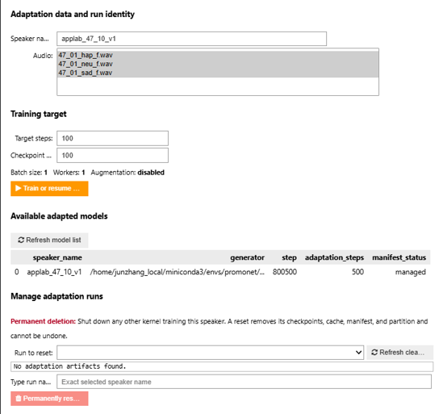
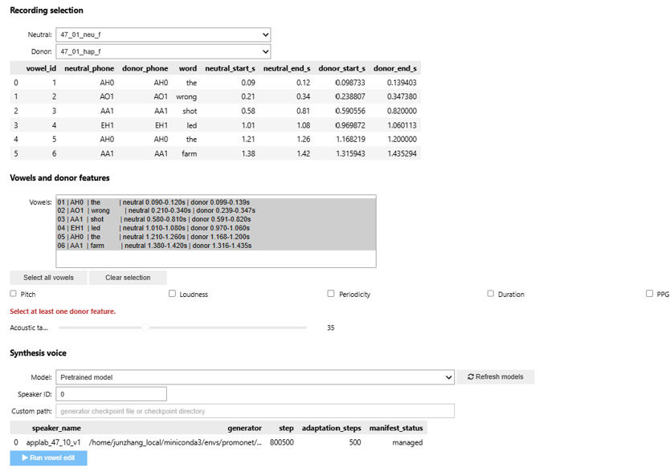

# ProMoNet Vowel Emotion Editing

This repository provides two Jupyter notebook interfaces for:

1. adapting ProMoNet to a target speaker; and
2. editing selected vowels in a neutral recording with features taken from a sentence-matched emotional donor recording.

This README covers environment setup, the two interfaces, and the objective
DNSMOS Pro and audEERING analyses used by the project website.

## Requirements

- Windows with WSL2/Ubuntu, or a Linux system
- Conda or Miniconda
- Git and FFmpeg
- JupyterLab with widget support
- An NVIDIA GPU is strongly recommended for adaptation and synthesis. The notebooks detect CUDA automatically and fall back to CPU, but CPU execution can be very slow.

The package versions tested for this project are:

| Package | Tested version |
|---|---:|
| Python | 3.10 |
| PyTorch | 2.11.0+cu130 |
| TorchAudio | 2.11.0+cu130 |
| TorchCodec | 0.11.1 |
| ProMoNet | 0.0.1 |
| PENN | 0.1.0 |
| Torbi | 1.4.0 |

## Build the environment

Run the following commands in a WSL or Linux terminal.

### 1. Clone the repository

```bash
git clone https://github.com/JunZhangCI/promonet-vowel-emotion-editing.git
cd promonet-vowel-emotion-editing
```

### 2. Create the Conda environment

```bash
conda env create -f environment.yml
conda activate promonet
```

To update an existing environment instead:

```bash
conda env update -f environment.yml --prune
conda activate promonet
```

### 3. Install the tested audio-model stack

The following commands reproduce the tested CUDA 13.0 configuration:

```bash
python -m pip install \
  torch==2.11.0 torchaudio==2.11.0 \
  --index-url https://download.pytorch.org/whl/cu130

python -m pip install \
  torchcodec==0.11.1 \
  torbi==1.4.0 \
  penn==0.1.0 \
  promonet==0.0.1
```

If CUDA 13.0 is not compatible with your GPU driver, use the command generated by the [official PyTorch installation selector](https://pytorch.org/get-started/locally/) and keep the `torch` and `torchaudio` versions matched. The [official ProMoNet repository](https://github.com/maxrmorrison/promonet) provides additional dependency guidance. Avoid mixing CPU and CUDA wheels in one environment.

### 4. Register the Jupyter kernel

```bash
python -m ipykernel install \
  --user \
  --name promonet \
  --display-name "Python (ProMoNet WSL)"
```

Verify the installation:

```bash
python -c "from importlib.metadata import version; import torch, torchaudio, torchcodec, promonet, penn, torbi; print('CUDA:', torch.cuda.is_available()); print('ProMoNet:', version('promonet'))"
```

Then launch JupyterLab from the repository root:

```bash
jupyter lab
```

Open each notebook with the **Python (ProMoNet WSL)** kernel and use **Kernel > Restart Kernel and Run All Cells** to initialize its interface.

## Prepare input recordings

Place adaptation and editing recordings in `audio/`. For vowel editing, place a same-stem Praat TextGrid in `audio/textgrids/` for every WAV:

```text
audio/
├── sentence_01_neu.wav
├── sentence_01_hap.wav
├── sentence_01_sad.wav
└── textgrids/
    ├── sentence_01_neu.TextGrid
    ├── sentence_01_hap.TextGrid
    └── sentence_01_sad.TextGrid
```

Each TextGrid must contain a `phones` tier with ARPAbet phone labels. A `words` tier is optional but useful because the interface displays the word associated with each vowel. The neutral and donor files used in one edit must contain the same sentence and the same vowel sequence.

## 1. Speaker-adaptation interface

Open `vowel_edit_pipeline/speaker_adaptation.ipynb` and run all cells.



*Speaker-adaptation interface for choosing source recordings, setting the training target, and managing adapted checkpoints.*

To create or resume an adapted voice:

1. Enter a unique **Speaker name**. Use letters, numbers, underscores, or hyphens only.
2. Select one or more WAV files under **Audio**. More speech and greater phonetic variety generally produce a more reliable voice model.
3. Set **Target steps**. This is the total adaptation target, not the number of extra steps. For example, changing a completed 100-step run to 500 continues it to 500 adaptation steps.
4. Set **Checkpoint every** to control how often a recoverable checkpoint is written.
5. Click **Train or resume adaptation** and keep the kernel running until completion.
6. Confirm that the model appears under **Available adapted models**.

The default 100 steps is suitable for checking that the workflow runs, not for judging final speaker quality. A run can resume only when its speaker name and selected source recordings match its saved manifest.

The **Manage adaptation runs** controls permanently remove a selected run's checkpoints and related artifacts. Use them only after reviewing the displayed paths and shutting down any other kernel training that speaker.

## 2. Vowel-editing interface

After adaptation, open `vowel_edit_pipeline/vowel_edit_pipeline.ipynb` in the same environment and run all cells.



*Donor-based vowel-editing interface for selecting recordings, vowel regions, transferred features, and a synthesis voice.*

To create an edit:

1. Under **Recording selection**, choose the neutral recording to edit and a sentence-matched emotional **Donor** recording.
2. Inspect the matched-vowel table. The interface stops if the normalized vowel sequences do not agree.
3. Select one or more rows under **Vowels and donor features**.
4. Select at least one donor feature:

   - **Pitch** transfers the donor fundamental-frequency trajectory.
   - **Loudness** transfers the donor loudness trajectory.
   - **Periodicity** transfers the donor voicing-confidence trajectory.
   - **Duration** changes the selected neutral vowels to the donor vowel durations.
   - **PPG** experimentally transfers the donor phonetic posteriorgram.

5. Set the **Acoustic taper**. `0 ms` makes a hard replacement; a larger value blends the acoustic feature boundaries. PPG transfer always uses a hard splice.
6. Under **Synthesis voice**, choose one of the following:

   - **Pretrained model** and the appropriate VCTK speaker ID;
   - an **Adapted model**, which automatically uses speaker ID `0`; or
   - **Custom checkpoint path** for a generator checkpoint not discovered automatically.

7. Click **Refresh models** if an adaptation finished after the editor was opened.
8. Click **Run vowel edit**.

The notebook plays both the reconstructed neutral baseline and edited result, plots their acoustic trajectories, and saves three artifacts in `vowel_edit_pipeline/outputs/`:

- an edited `.wav` file;
- an `_audit.csv` file describing each vowel edit; and
- a `_features.pt` bundle containing the edited ProMoNet tensors and metadata.

## 3. Objective analysis and website assets

### DNSMOS Pro predicted speech quality

DNSMOS Pro predicts a speech-quality mean opinion score (MOS); it is not a
speech-recognition intelligibility test. The analysis uses the NISQA checkpoint
from DNSMOSPro commit `72f0fa4f71a41e70f12718be214665b1bf4fcbec`.
The first run downloads that pinned checkpoint into `.cache/dnsmospro/`.

Before scoring the website examples, copy the sentence-47_01 Praat outputs to
the fixed names expected by the manifest:

```powershell
Copy-Item "outputs/praat_pipeline/speaker_47/47_01_neu_from_hap__donor-contours__features-pitch-loudness-duration__20260822-193735.wav" "outputs/web_examples/praat_neu-to-hap.wav"
Copy-Item "outputs/praat_pipeline/speaker_47/47_01_neu_from_sad__donor-contours__features-pitch-loudness-duration__20260822-193735.wav" "outputs/web_examples/praat_neu-to-sad.wav"
```

Run the notebooks in this order:

1. `analysis/dnsmos_all_audio_analysis.ipynb` scores the 150 originals, 149
   vowel-edit outputs, and 99 Praat outputs and creates the 3×3 average table.
2. `analysis/dnsmos_web_examples.ipynb` requires exactly 11 example WAVs,
   creates `outputs/dnsmos/web_example_scores.csv`, and generates matching
   spectrograms under `outputs/web_examples/` and `docs/images/spectrograms/`.

The three full score tables and the average table are written under
`outputs/dnsmos/`. Every raw score row retains the predicted MOS mean, model
variance, speaker, sentence, condition, donor emotion, and pinned model details.
Set `DNSMOS_DEVICE=cuda` to require a GPU, or leave it unset for automatic
CPU/GPU selection. Set `DNSMOS_FORCE_RECOMPUTE=true` only when every score must
be regenerated.

### audEERING target movement

Run `analysis/audeering_emotion_scores.ipynb` before
`analysis/audeering_emotion_analysis.ipynb`. The analysis notebook creates:

- sentence-matched target gains and bootstrap median summaries;
- two-sided paired ProMoNet–Praat t-tests for happy and sad targets;
- the annotated three-panel validation figure; and
- an original-only arousal–valence figure with centroids and 50% covariance
  data ellipses.

Generated CSVs and figures are saved under `outputs/audEERING/`. The PNG assets
used by the static website are mirrored under `docs/images/`.

### ElevenLabs comparison screenshot

See `analysis/elevenlabs_screenshot_guide.md` for a repeatable happy/sad prompt
example and a privacy-safe crop checklist. The screenshot is intentionally not
committed because the project uses it only as an explanatory comparison, not as
analysis input.

## Troubleshooting

- **Imports fail:** confirm that Jupyter is using the `promonet` kernel rather than the system Python kernel.
- **Widgets appear as plain text or do not respond:** restart JupyterLab after installing `ipywidgets`, then restart the kernel and run all cells.
- **No recordings appear:** launch Jupyter from inside the repository and check the `audio/` folder layout.
- **A WAV is missing from the vowel editor:** verify that a same-stem TextGrid exists under `audio/textgrids/`.
- **Vowel matching fails:** use recordings of the same sentence and correct the `phones` tiers or timestamps in their TextGrids.
- **An adapted model is missing:** finish adaptation, return to the editor, and click **Refresh models**.
- **CUDA is unavailable:** check `nvidia-smi` in WSL and verify that the PyTorch wheel matches the installed NVIDIA driver.
